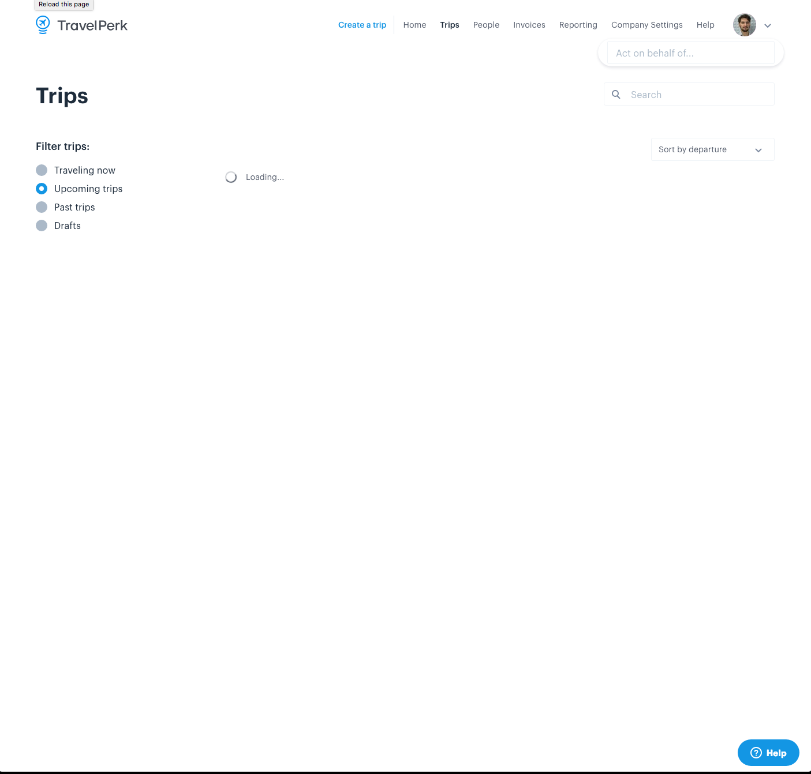
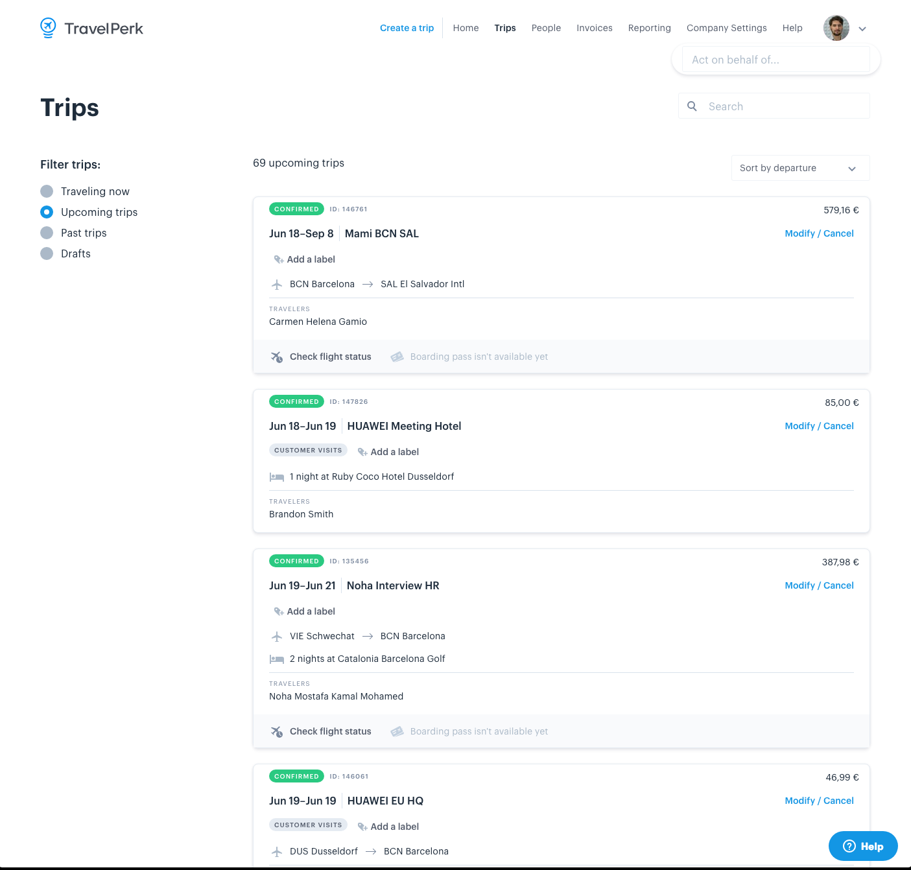

# How to test your application

> "Testing can show the presence of errors, but not their absence." — E.W.
> Dijkstra

## Why we test

The role of tests is to give developers confidence in their implementation.
Confidence it's not to be confused with certainty. There will always be bugs
that your tests didn't cover but at least you'll be 99.9% confident that when a
user clicks on "Pay now" the app doesn't blow up.

What kind of test gives you the highest confidence? Imagine you want to know if
a particular feature works or is broken. How do you test it? If you want to be
as sure as possible you're going to open your browser and try the feature.

Manual tests are the best tests when it comes to confidence. Unfortunately, they
have a very big problem: you need to do all the work. Of course, this becomes
unmanageable as your project grows. For this reason we write automated tests.

Still, your automated tests should try to simulate as closely as possible what
you do when you test manually.

> "The more your tests resemble the way your software is used, the more
> confidence they can give you." —
> [Kent C. Dodds](https://twitter.com/kentcdodds/status/977018512689455106)

Following this principle if you write a test that doesn't resemble what you
would do you should stop and think how to improve it. Take the following
example:

```jsx
describe('<Button>', () => {
  it('should render', () => {
    const wrapper = shallow(<Button>Hello</Button>)
    expect(wrapper).toMatchSnapshot()
  })
})
```

Does it give you confidence? Sure it checks that at least the component renders
but it doesn't test what gets rendered. For all you know the `Button` component
might be rendering `null`.

## Types of tests

There are different kinds of tests that apply to different contexts but in
general we can distinguish three main categories: end-to-end tests (sometimes
called E2E or functional tests), integration tests and unit tests.

E2E are the most exhaustive because they test your application running in a real
browser and performing real network calls. For this reason they're also the
slowest to run and the hardest to implement.

Integration tests are in the middle, they test that various components interact
correctly with each other but they run in a simulated DOM environment. They are
faster than E2E but not as fast as unit tests.

Last, unit tests, they run fast and they are easy to write but they only check a
tiny portion of your app. For example they test if a button can be clicked. They
don't check what happens after the button has been clicked though.

In general, you should strive to have as many integration tests as possible
because they give a good balance between effort and confidence. E2E should test
at least your happy paths, or the most common interactions your users have with
the app. Unit test are a useful for edge cases and great help when you're
developing, especially if you practice TDD.

## How to test

We're going to write some integration tests for our trip list page. First let's
analyze what the page does and how we would manually test it.

When you visit the trip list you see something like this:



And after the page finishes to load:



The trip list loads the first 10 trips and it shows them to you. This right
there is a first test we can implement.

Before we do that though, let's quickly introduce the _black box principle_.

### The black box principle

Consider this test:

```jsx
describe('<NewUserProfile>', () => {
  it('should create a new user when handleUserCreation is called', async () => {
    const wrapper = shallow(<NewUserProfile />)
    wrapper.setState({ email: 'new-user@gmail.com' })
    await wrapper.instance().handleUserCreation()
    expect(createUserMock).toHaveBeenCalledTimes(1)
    expect(createUserMock).toHaveBeenCalledWith({ email: 'new-user@gmail.com' })
  })
})
```

This test has two big problems. First, it's testing the instance method
`handleUserCreation`, second that method is returning a `Promise` so that it can
be tested. Nothing in this test is making sure that `handleUserCreation` is
actually called at some point. Nothing makes sure that other part of
`NewUserProfile` or its children don't crash while we create a user.

This kind of testing is called white-box testing. It means that the developer
knows how the program is implemented and tests accordingly. A better way to test
is black-box testing. In this case the developer doesn't know the implementation
and can only provide inputs to the system and analyze the outputs.

In a web application an input could be anything that the user does: clicking on
a button, resizing the window etc. An output is represented by what's rendered
on the screen but also what network requests get performed, the content of
`localStorage` etc.

If we want to adopt a black-box testing approach it's advisable not to use
[enzyme](http://airbnb.io/enzyme/) because it provides too many methods built to
test a component's implementation—`setState`, `instance`, etc.

A library that is black-box driven is
[`react-testing-library`](https://github.com/kentcdodds/react-testing-library).
Let's see how we could have implemented the previous test using it:

```jsx
describe('<NewUserProfile>', () => {
  it('should allow to create a new user', async () => {
    const { getByLabel, getByText } = render(<NewUserProfile />)
    const emailInput = getByLabel('Email')
    emailInput.value = 'new-user@gmail.com'
    fireEvent.change(emailInput)

    const user = Fabricate('user', { email: 'new-user@gmail.com' })
    mockFetchOnce(user)
    getByText('Create User').click()
    await waitForElement(() => getByText('User new-user@gmail.com created!'))
  })
})
```

This test is better than the previous one for several reasons. It's not testing
if a user gets created by a particular method, it's testing the whole
interaction a real user would have with the application. First it enters the
value in an input field, then clicks on a button and lastly it checks that the
page changed accordingly.

If some of the children fails it will fail too. But if the internal workings of
`NewUserProfile` changes—maybe because of a refactor—the test will still work
granted that the interface the user sees remains the same.

The previous test would have failed if we renamed `handleUserCreation`, this one
doesn't even know the method exists in the first place.

If for some reason we don't call `handleUserCreation` on click this test will
fail, the previous one didn't even know about the button.

### Testing the trip list

Back to our test, let's start by setting up our environment:

```jsx
import React from 'react'
import { render, cleanup } from 'react-testing-library'
import TripList from './TripList'

describe('<TripList>', () => {
  afterEach(cleanup)

  it('should load and show the first ten trips', () => {
    render(<TripList />)
  })
})
```

This code will probably won't work. The reason is because top level components
like `TripList` rely on some global values. Which ones depends on your
application. Simply run your tests and see what errors you get. For now we're
going to assume that routing, i18n and the current user are missing.

```jsx
import currentUserContext from 'app/contexts/currentUserContext'
import { IntlProvider } from 'react-intl'
import { MemoryRouter as Router } from 'react-router-dom'

it('should load and show the first ten trips', () => {
  const user = Fabricate('user')
  renderTripList({ user })
})

function renderTripList({ user }) {
  return render(
    <currentUserContext.Provider value={user}>
      <IntlProvider locale={user.locale}>
        <Router>
          <TripList />
        </Router>
      </IntlProvider>
    </currentUserContext.Provider>
  )
}
```

The `renderTripList` function spares us from having to write the same components
chain for every test we write.

For more info about the `Fabricate` call check
[fabricator](https://github.com/travelperk/fabricator).

The test is probably still failing but this time for a different reason. As soon
as `TripList` mounts it starts to fetch some data. Specifically the list of
trips to show. Since, our tests are not connected to the external world we have
to mock these calls.

```jsx
it('should load and show the first ten trips', () => {
  const trips = Fabricate.times(10, 'dashboardTrip')
  mockFetchOnce({ count: 23, results: trips })
  const user = Fabricate('user')
  renderTripList({ user })
})
```

Now our component should be rendering just fine. We can test that the loading
page is shown.

```jsx
it('should load and show the first ten trips', () => {
  const trips = Fabricate.times(10, 'dashboardTrip')
  mockFetchOnce({ count: 23, results: trips })
  const user = Fabricate('user')
  const { getByText } = renderTripList({ user })

  expect(getByText('Loading...')).toBeInTheDOM()
})
```

We are looking in the DOM and we expect to see the string `Loading...`. This is
very close to what you would do manually.

Next, we want to make sure that the loaded trips are displayed. For this there's
no need to mock the fetch method we can simply wait until the data appears.

```jsx
import { waitForElement } from 'react-testing-library'

it('should load and show the first ten trips', async () => {
  const trips = Fabricate.times(10, 'dashboardTrip')
  mockFetchOnce({ count: 23, results: trips })
  const user = Fabricate('user')
  const { getByText } = renderTripList({ user })

  expect(getByText('Loading...')).toBeInTheDOM()

  await waitForElement(() => getByText('23 upcoming trips'))
})
```

When the string `23 upcoming trips` is visible it means that the page has been
loaded.

At this point we can check that all the trips are shown. Now we need to cheat a
little. We can't identify a trip card by its text so we had a `data-testid`
attribute to it.

```jsx
// In the render method for the trip list
trips.map(trip => <TripCard trip={trip} data-testid={`TripCard-${trip.id}`} />)
```

We can then easily test that each card is rendered with the correct value.

```jsx
it('should load and show the first ten trips', async () => {
  const trips = Fabricate.times(10, 'dashboardTrip')
  mockFetchOnce({ count: 23, results: trips })
  const user = Fabricate('user')
  const { getByText } = renderTripList({ user })

  expect(getByText('Loading...')).toBeInTheDOM()

  await waitForElement(() => getByText('23 upcoming trips'))

  trips.forEach(trip => validateTripCard({ trip, getByTestId }))
})

function validateTripCard({ trip, getByTestId }) {
  const { getByText } = getQueriesForElement(getByTestId(`TripCard-${trip.id}`))
  if (trip.status === 'booked') {
    expect(getByText('CONFIRMED')).toBeInTheDOM()
  } else if (trip.status === 'saved') {
    expect(getByText('DRAFT')).toBeInTheDOM()
  }
  expect(getByText(`ID: ${trip.id}`)).toBeInTheDOM()
  expect(getByText(trip.purpose)).toBeInTheDOM()
  // And some other checks removed for brevity...
}
```

This is in a nutshell how to test the trip list. Of course, the test can be
extended to interact with the filters, the cards and the pagination, but the
basic idea is the same.
